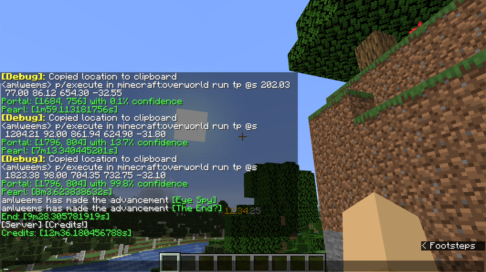
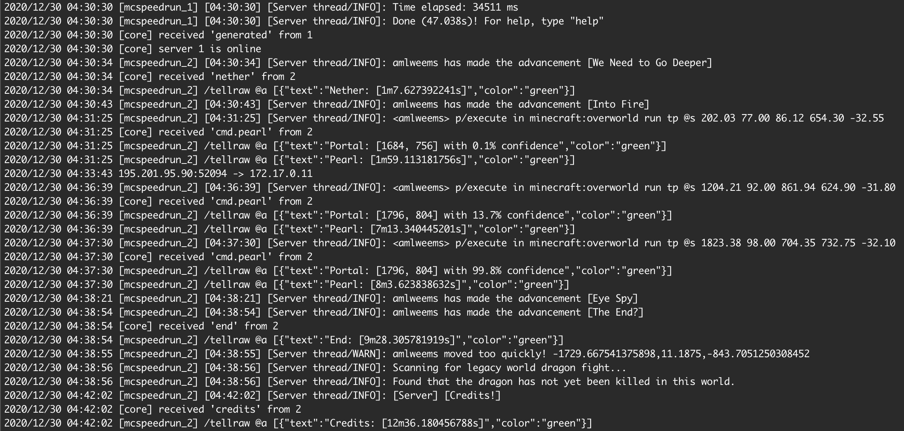

# mcspeedrun
manage minecraft speedrun servers

## Features

* Proxy connections to the running server
* Type `rr` in chat to reset a server
* Detect game events and record splits in chat
* Compute stronghold coordinates using [dantoye/throwpro](https://github.com/dantoye/throwpro)
  * Throw a pearl and look at the center
  * Press F3+C to copy current coordinates
  * Type `tp` and paste to enter "p/execute ..." in chat




## Install

Download the [release binaries](https://github.com/amlweems/mcspeedrun/releases)
or build from `main` using `go`:

```
go build
```

## Usage

```
$ mcspeedrun
Usage of mcspeedrun:
  -image string
    	docker image for servers (default "tigres/minecraft-fabric:latest")
  -replicas int
    	number of replicas (default 2)
```

```
$ mcspeedrun -replicas 3
2006/01/02 15:04:05 [proxy] switching to
2006/01/02 15:04:05 [core] replica 0 is not ready
2006/01/02 15:04:05 [core] replica 1 is not ready
2006/01/02 15:04:05 [core] replica 2 is not ready
2006/01/02 15:04:05 [core] no active server
2006/01/02 15:04:06 [minecraft_speedrun_0] [15:04:06] [main/INFO]: Loading for game Minecraft 1.16.1
2006/01/02 15:04:06 [minecraft_speedrun_1] [15:04:06] [main/INFO]: Loading for game Minecraft 1.16.1
2006/01/02 15:04:07 [minecraft_speedrun_2] [15:04:07] [main/INFO]: Loading for game Minecraft 1.16.1
```
